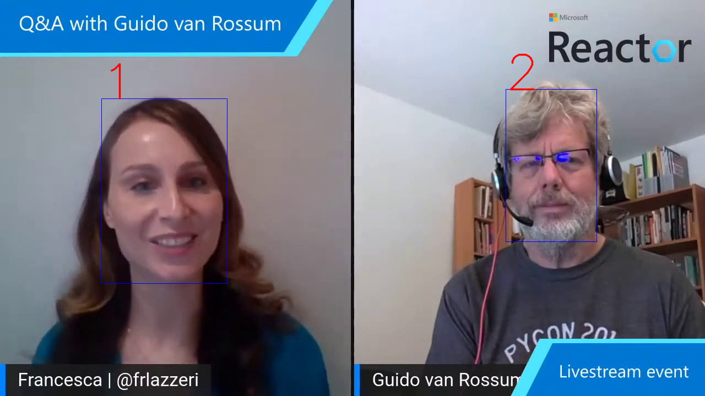

# FFC
<h2>Зачем</h2>
Сейчас стало модным проводить мероприятия, когда на сцене одновременно находятся несколько спикеров (ведущих, выступающих). Во время трансляции таких форумов спикеры постоянно меняют свою роль на сцене: передают друг другу слово, оппонируют. Кроме этого они могут передвигаться по сцене. Для качественной трансляции требуется профессиональная работа оператора, который должен постоянно направлять камеру на перемещающегося спикера и перемещать камеру на другое лицо, если ему передали слово.
При таком освещении выступления могут происходить казусы, когда оператор не успевает среагировать камеру на конкретном спикере. Чтобы это исключить, операторы, чаще всего, берут ракурс на удаленной съемке, чтобы сам зритель переводил свой взгляд с одного спикера на другого или следил за перемещающимся спикером. Но в этом случае теряется выражение лица людей, которые выступают на сцене.
Предлагаемая мною программа позволяет определить все лица, присутствующие на сцене, выбрать пользователю интересующего его спикера и показывать только данного спикера. Пользователь может поменять одного спикера на другого и программа показывать уже нового человека. 
Программа позволяет работать как онлайн, так и с записанным видео какого-либо мероприятия.
<h2>Что я предоставляю</h2>
Я предоставляю, как программу для выполнения вышеупомянутых задач, так и API^ с помощью которого, любой разработчик сможет добавить аналогичные функции в свою программу.
<h2>Пример работы</h2>

<h2>Как происходит выбор лица</h2>
Как показано в предыдущем пункте, рядом с лицами появляются цифры, при нажатии которых на клавиатуре, лицо, цифру которого нажали будет становиться основным и за ним будет "следить" камера.